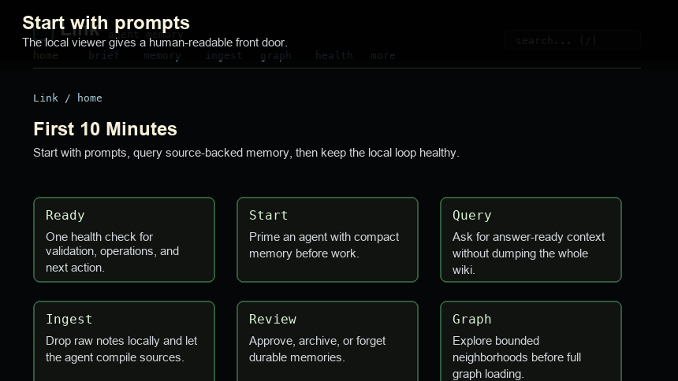
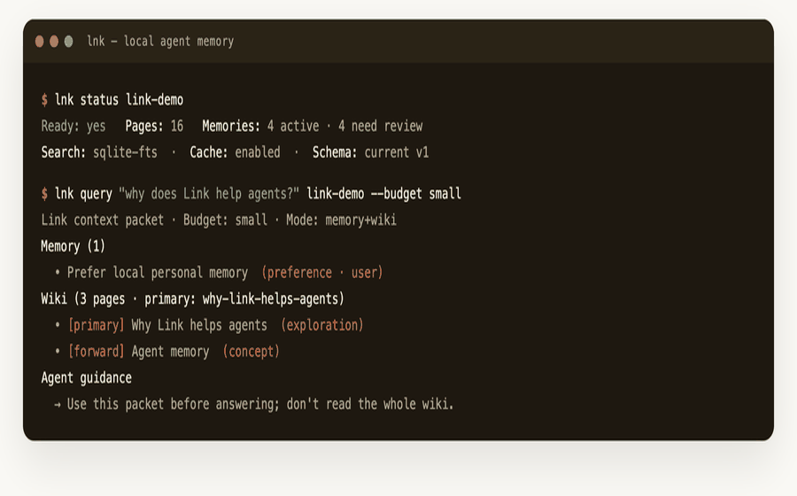
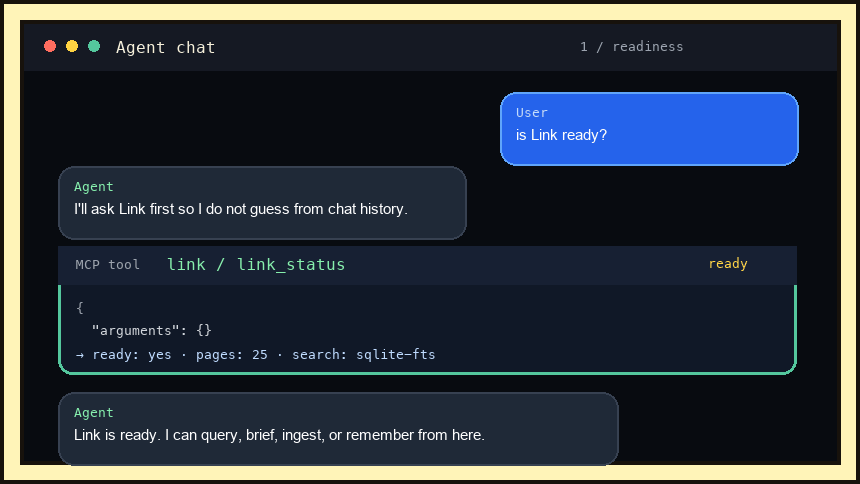
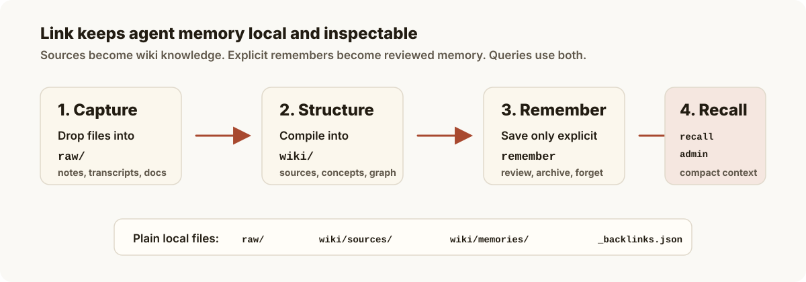

<p align="center">
  
</p>

<h1 align="center">Link</h1>

<h2 align="center">Local memory for AI agents.</h2>

<p align="center">
  Link gives Codex, Claude, Cursor, Kiro, VS Code, Copilot, Antigravity, and
  other MCP clients the same source-backed memory, stored locally as Markdown.
</p>

<p align="center">
  <a href="https://gowtham0992.github.io/link/">Website</a> ·
  <a href="https://gowtham0992.github.io/link/getting-started.html">Quick start</a> ·
  <a href="https://gowtham0992.github.io/link/mcp.html">MCP setup</a> ·
  <a href="https://gowtham0992.github.io/link/skills.html">Skills</a> ·
  <a href="https://gowtham0992.github.io/link/cli.html">CLI</a> ·
  <a href="https://registry.modelcontextprotocol.io/?q=io.github.gowtham0992%2Flink">MCP Registry</a> ·
  <a href="https://pypi.org/project/link-mcp/">PyPI</a> ·
  <a href="https://github.com/gowtham0992/homebrew-link">Homebrew</a>
</p>

<p align="center">
  <a href="https://github.com/gowtham0992/link"></a>
  <a href="https://github.com/gowtham0992/link/actions/workflows/ci.yml"></a>
  <a href="https://registry.modelcontextprotocol.io/?q=io.github.gowtham0992%2Flink"></a>
  <a href="https://pypi.org/project/link-mcp/"></a>
</p>

## What Is Link?

Link is an open-source memory layer for local AI agents. Raw sources become an
inspectable Markdown wiki. Explicit "remember this" requests become reviewable
memories. Agents retrieve compact, source-backed context through MCP without
dumping the whole wiki into a chat window.

The wiki is the storage layer. The product is durable memory that stays on your
machine, remains readable in plain files, and can be shared across multiple
agents instead of locked inside one vendor profile.

## How It Works

Link gives agents four simple moves:

1. **Capture** notes, transcripts, docs, screenshots, and project context in `raw/`.
2. **Structure** source-backed pages under `wiki/`.
3. **Remember** explicit preferences, decisions, facts, and project context as reviewable memory.
4. **Retrieve** compact query packets through CLI, MCP, or the local web viewer.

Most agent sessions start from zero. You re-explain preferences, repo decisions,
project constraints, and why something matters. Link turns that repeated context
into local memory agents can query.

| Pain | Link's answer |
|------|---------------|
| Agents forget you between sessions. | Save reviewed preferences, decisions, facts, and project context. |
| Notes are private or messy. | Keep raw sources local, then turn them into source-backed Markdown. |
| Context windows are expensive. | Return compact query packets with provenance and follow-up actions. |
| Memory needs trust. | Every page and memory can be inspected, reviewed, archived, or forgotten. |

Link follows Andrej Karpathy's
[LLM Wiki pattern](https://gist.github.com/karpathy/442a6bf555914893e9891c11519de94f):
keep knowledge outside the chat window, make claims inspectable, and let context
compound over time.

## Quick Start

Run the demo first. It creates a complete local wiki with raw sources, wiki
pages, one starter memory, graph data, and query packets ready to inspect.

macOS with Homebrew:

```bash
brew install gowtham0992/link/link
lnk try
lnk serve link-demo
```

The installed command is `lnk` because `link` is already a POSIX/macOS system
utility. From a source checkout, use `python3 link.py ...` instead.

Windows or source checkout:

```powershell
git clone https://github.com/gowtham0992/link.git
cd link
py link.py demo
py link.py next link-demo
py link.py serve link-demo
```

Or from source:

```bash
git clone https://github.com/gowtham0992/link.git
cd link
python3 link.py demo
python3 link.py next link-demo
python3 link.py serve link-demo
```

Use `lnk try` for the shortest Homebrew proof loop. It creates the demo,
checks readiness, runs a compact query/brief proof, and prints the agent prompts
and viewer command. From source, use `python3 link.py try`.

The Homebrew formula is maintained in the public
[`gowtham0992/homebrew-link`](https://github.com/gowtham0992/homebrew-link) tap.

Open:

```text
http://127.0.0.1:3000
http://127.0.0.1:3000/graph
http://127.0.0.1:3000/health
```

The web viewer is for local use only. It binds to `127.0.0.1`, has no user
accounts or authentication, and should not be exposed to the internet unless you
add your own auth layer.

For the shortest guided proof path, run `lnk welcome link-demo`.

Try the value loop:

```bash
lnk query "why does Link help agents?" link-demo --budget small
lnk brief "working on agent memory" link-demo
lnk benchmark "agent memory" link-demo
lnk health link-demo
```

The `/health` page mirrors the readiness loop in the browser: validation state,
interrupted writes, memory review status, and copyable repair commands.
The viewer itself stays document-first: common paths are in the top nav, deeper
tools live under `more`, and structured wiki pages get a local contents outline
plus related-page links from the graph.
Home shows recently updated pages, while `/all` and search group results by page
type with chips for narrowing larger wikis.

From a source checkout, use `python3 link.py ...`:

```bash
python3 link.py query "why does Link help agents?" link-demo --budget small
python3 link.py brief "working on agent memory" link-demo
python3 link.py benchmark "agent memory" link-demo
python3 link.py health link-demo
```

The generated demo is the public proof wiki. The repo's root `wiki/` directory
is only a scaffold for local development and personal testing. Generated content
inside `wiki/`, `raw/`, and `link-demo/` is ignored by git so personal memory is
not published by accident.

For local scale checks from a source checkout, run:

```bash
python3 scripts/smoke_large_wiki.py --pages 10000
```

This generates a temporary synthetic wiki, verifies bounded graph/query payloads,
and reports cache timing, persistent-cache reuse, search, query, graph, and
health signals without touching your real Link wiki.
The public scale model is documented at
[Link Scale](https://gowtham0992.github.io/link/scale.html): what stays
bounded by default, how to measure your own wiki, and where the current local
limits are.

## Ways To Use Link

Pick the surface that matches how you work. They all read and write the same
local Markdown wiki.

These surfaces are independent. `lnk serve` / `serve.py` is only the local web
viewer. CLI commands, official skills, and MCP tools read the same `wiki/` files
directly, so Claude, Codex, Kiro, Cursor, or another agent can use Link even
when the web viewer is not running.

<table>
  <tr>
    <td width="33%">
      <strong>Web UI</strong><br>
      Read the local wiki, then review memory, ingest, graph, audits, captures, and explanations.<br><br>
      <a href="https://gowtham0992.github.io/link/ui.html"></a>
    </td>
    <td width="33%">
      <strong>CLI</strong><br>
      Script readiness, query packets, briefs, validation, backup, benchmark, and repair.<br><br>
      <a href="https://gowtham0992.github.io/link/cli.html"></a>
    </td>
    <td width="33%">
      <strong>MCP</strong><br>
      Let Codex, Claude, Cursor, Kiro, VS Code, Copilot, and other agents recall memory.<br><br>
      <a href="https://gowtham0992.github.io/link/mcp.html"></a>
    </td>
  </tr>
</table>

Prefer skills instead of MCP? Link ships small, lazy-loadable CLI skills under
`skills/`. They let an agent use `lnk health`, `lnk query`, `lnk ingest-status`,
and `lnk remember` directly, without MCP setup or a running web viewer.

```text
skills/link-health/SKILL.md
skills/link-retrieve/SKILL.md
skills/link-ingest/SKILL.md
skills/link-memory/SKILL.md
```

Full guide: [Link Skills](https://gowtham0992.github.io/link/skills.html).

## Install For Your Agent

Run one installer from the cloned checkout:

```bash
bash integrations/codex/install.sh
bash integrations/kiro/install.sh
bash integrations/claude-code/install.sh
bash integrations/cursor/install.sh
bash integrations/copilot/install.sh
bash integrations/vscode/install.sh
bash integrations/antigravity/install.sh
```

Installers create or update `~/link`, install or upgrade `link-mcp`, write
lightweight agent instructions, and preserve existing wiki data on reinstall.
Use `--project` when a repo needs separate project memory.

On Windows, use the matching PowerShell installer:

```powershell
.\integrations\codex\install.ps1
.\integrations\kiro\install.ps1
.\integrations\claude-code\install.ps1
.\integrations\cursor\install.ps1
.\integrations\copilot\install.ps1
.\integrations\vscode\install.ps1
.\integrations\antigravity\install.ps1
```

Then ask your agent:

```text
is Link ready?
brief me from Link before we continue
ingest raw/notes.md into Link
remember that I prefer short release notes
query Link for the release process
what does Link remember about local personal memory?
```

If your agent already has instructions and you only need MCP wiring, use the
connection helper. It previews the exact config first; add `--write` when you
want Link to update the agent config file.

```bash
lnk connect codex ~/link
lnk connect codex ~/link --write
lnk connect kiro ~/link --write
lnk verify-mcp ~/link
```

<details>
<summary>MCP-only install</summary>

```bash
python3 -m pip install --upgrade link-mcp
python3 -m link_mcp --version
```

```json
{
  "mcpServers": {
    "link": {
      "command": "python3",
      "args": ["-m", "link_mcp", "--wiki", "~/link/wiki"]
    }
  }
}
```

On macOS/Homebrew Python, if pip reports `externally-managed-environment`, use a
dedicated venv:

```bash
python3 -m venv ~/.link-mcp-venv
~/.link-mcp-venv/bin/python -m pip install --upgrade pip link-mcp
```

Full setup: [MCP guide](https://gowtham0992.github.io/link/mcp.html).
</details>

Obsidian users can import an existing vault into `raw/` for agent ingest, or
open `~/link/wiki` directly as a vault for editing Link pages:

```bash
lnk init ~/link
lnk import-obsidian ~/Documents/ObsidianVault ~/link
```

See the [Obsidian guide](https://gowtham0992.github.io/link/obsidian.html) for
the import, edit, and validation loop.

## Storage Model

Under the hood, Link separates source-backed knowledge from durable agent memory:

1. Drop raw notes, transcripts, articles, and project context into `raw/`.
2. Agents compile those sources into inspectable pages under `wiki/`.
3. Explicit "remember" requests become reviewable memory pages.
4. Queries retrieve compact MCP context from both the wiki and memory layer.

<p align="center">
  
</p>

The storage model is plain and inspectable:

| Layer | What lives there |
|-------|------------------|
| `raw/` | Original notes, transcripts, articles, PDFs, screenshots, and project files. |
| `wiki/` | Source-backed pages, concepts, entities, explorations, comparisons, and memories. |
| MCP tools | Compact packets agents can use without dumping the whole wiki into context. |

If a raw file was already ingested and later edited, `lnk ingest-status` marks it
as stale and tells your agent to refresh the existing source page instead of
creating a duplicate.

## What Agents Get

- `query_link`: an answer-ready packet with relevant memories, pages, graph
  neighborhood, reasons for selection, budget limits, and follow-up actions.
- `memory_brief`: a compact pre-work brief with user/project preferences,
  active context, review warnings, and safe memory-use rules.
- `ingest_status`: exact next steps for raw files, including source safety,
  stale ingest detection, validation, and memory proposal guidance.
- `remember_memory`: durable local memory with duplicate/conflict checks,
  `visibility` sharing intent, review state, optional `review_after` re-check
  dates, optional `expires_at` expiry dates, provenance, and audit logging.
- `set_memory_visibility`: explicit post-review sharing changes between
  `private`, `project`, and `team` visibility without editing Markdown by hand.
- `explain_memory`: why a memory exists, what it links to, whether it is ready
  for recall, and what needs review.
- `memory_log`: recent memory lifecycle changes from `wiki/log.md`, without
  raw source or memory bodies.
- `memory_wins`: local proof signals for what Link memory is carrying, based
  on wiki metadata rather than telemetry.

The stable agent-facing loop is documented at
[Link Memory Contract](https://gowtham0992.github.io/link/memory-contract.html):
readiness first, bounded recall, explicit memory writes, audit tools, and
sharing semantics.

Use `review_after` for time-sensitive preferences or decisions. When that date
arrives, the memory reappears in Link's review inbox so an agent can ask the
user to confirm, update, archive, or forget it instead of trusting stale context.
Use `expires_at` for temporary context that should automatically leave default
recall after a date; Link keeps the Markdown page inspectable and asks the user
to update, archive, or delete it.
Use `visibility` to separate where a memory applies from who should see it:
`private` stays personal, `project` is intended for a project workspace, and
`team` means the user explicitly approved sharing it with a team.

For team handoff or security review, `lnk compliance-export --output audit.json`
writes a redacted JSON packet with readiness, validation, memory review status,
operation markers, and recent audit log entries. Raw source contents and memory
bodies are not included.

For day-to-day auditability, `lnk memory-log ~/link` shows what Link recently
remembered, updated, reviewed, archived, restored, forgot, or accepted from raw
captures.

For recovery, `lnk backup ~/link` creates a local archive and `lnk
restore-backup <archive> ~/link` previews what would be restored. Passing
`--confirm` replaces local files after creating a safety backup when possible;
`raw/` is still excluded unless `--include-raw` is explicit.

For local proof of value, `lnk wins ~/link` shows reusable memories, reviewed
memory, provenance, project continuity, freshness guardrails, and copyable
prompts without tracking user behavior.

For Git-backed team memory, `lnk team-sync ~/link` checks whether the workspace
is ready to share reviewed `wiki/` pages while keeping `raw/`, caches, backups,
and local MCP Python markers private by default. It also blocks "ready" status
when the memory inbox is not clear or active `visibility: private` memories
would be included by a broad `git add wiki`.

```bash
lnk team-sync ~/link --remote git@example.com:team/link-memory.git
```

For a teammate, reviewer, or another agent, `lnk share` resolves a page,
memory, title, alias, or search phrase into a local viewer URL:

```bash
lnk share "Prefer local memory" ~/link
```

For a static, read-only review packet, `lnk snapshot` exports rendered wiki
HTML without `raw/`, captures, operation markers, live MCP state, or memory pages
by default. `--include-memories` exports only non-private memories; use
`--include-private-memories` only for a personal archive or an explicitly
approved review. It blocks export if wiki pages contain secret-looking values
unless you explicitly override it.

```bash
lnk snapshot ~/link --output link-snapshot
lnk snapshot ~/link --output link-snapshot --include-memories --force
lnk snapshot ~/link --output personal-snapshot --include-memories --include-private-memories --force
```

## Agent Contract

Agents should use Link in this order:

1. `link_status` to check readiness and safe next actions.
2. `starter_prompts` when the user asks what to try first.
3. `ingest_status` before touching raw sources.
4. `query_link` for compact answer-ready context.
5. `memory_brief` before longer work.
6. `get_graph_summary` when graph context is useful but the full graph would be noisy.
7. `backup_wiki` before broad repair or migration work.
8. `validate_wiki` after ingest or broad wiki edits.

Full MCP tool list: [MCP setup](https://gowtham0992.github.io/link/mcp.html).

## Privacy And Safety

Link itself is local-first:

- No telemetry in the installed CLI, MCP server, local web UI, or wiki runtime.
- No hosted backend.
- No external API calls from `serve.py` or `link-mcp`.
- Raw sources and generated wiki pages are ignored by git by default.
- `lnk backup` excludes `raw/` unless you explicitly pass `--include-raw`.
- Secret-looking API keys, provider tokens, JWTs, registry credentials, and
  private key blocks are detected in raw sources, captures, and release hygiene
  checks. `lnk validate` and `lnk doctor` also fail if secret-looking values
  are found inside wiki pages before they can be served through the local UI or
  returned through MCP context.
- The local web server binds to `127.0.0.1` and is not meant to be exposed to
  the internet without additional auth.

Before sharing a repo, demo, or wiki:

```bash
python3 link.py doctor
python3 link.py validate
python3 scripts/check_release_hygiene.py
```

More detail: [Security guide](https://gowtham0992.github.io/link/security.html).

## Documentation

| Need | Go here |
|------|---------|
| Run Link for the first time | [First 10 minutes](https://gowtham0992.github.io/link/getting-started.html) |
| Decide whether Link fits | [Why Link?](https://gowtham0992.github.io/link/why-link.html) |
| Use the local viewer | [Web UI](https://gowtham0992.github.io/link/ui.html) |
| Understand raw/wiki/memory | [Concepts](https://gowtham0992.github.io/link/concepts.html) |
| Configure MCP | [MCP setup](https://gowtham0992.github.io/link/mcp.html) |
| Find a command | [CLI reference](https://gowtham0992.github.io/link/cli.html) |
| Use Link without MCP setup | [Official skills](https://gowtham0992.github.io/link/skills.html) |
| Use local HTTP endpoints | [HTTP API](https://gowtham0992.github.io/link/api.html) |
| Review security boundaries | [Security model](https://gowtham0992.github.io/link/security.html) |
| Evaluate Link for a small team | [Team security review](https://gowtham0992.github.io/link/team-security.html) |
| Fix setup issues | [Troubleshooting](https://gowtham0992.github.io/link/troubleshooting.html) |

## Contributing

Contributions should come through pull requests targeting `main`. The `develop`
branch is a maintainer integration branch for larger release work before it is
proposed to `main`.

Before opening a PR:

```bash
python3 -m ruff check .
python3 -m pytest tests
python3 scripts/check_release_hygiene.py
python3 scripts/check_runtime_duplication.py
python3 scripts/check_tool_contract.py
git diff --check
```

Full contributor guide: [Contributing](https://gowtham0992.github.io/link/contributing.html).

Do not include personal wiki data, raw sources, registry tokens, `.env` files, or
local MCP credentials in a PR.

If Link helps your agents remember better, [star it on GitHub](https://github.com/gowtham0992/link)
so more people can find it.
