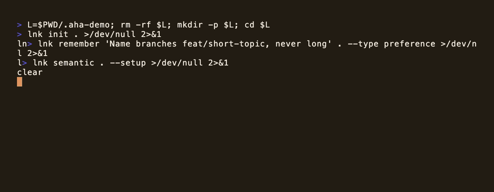

<p align="center">
  
</p>

<h1 align="center">Link</h1>

<h2 align="center">Local memory for AI agents.</h2>

<p align="center">
  Link gives Codex, Claude, Cursor, Kiro, VS Code, Copilot, Antigravity, and
  other local agents the same source-backed memory, stored locally as Markdown.
</p>

<p align="center">
  <a href="https://gowtham0992.github.io/link/">Website</a> ·
  <a href="https://gowtham0992.github.io/link/#how">How it works</a> ·
  <a href="https://gowtham0992.github.io/link/#memory">Memory</a> ·
  <a href="https://gowtham0992.github.io/link/#tools">Tools &amp; CLI</a> ·
  <a href="https://gowtham0992.github.io/link/#setup">Setup</a> ·
  <a href="https://gowtham0992.github.io/link/getting-started.html">Docs</a> ·
  <a href="https://registry.modelcontextprotocol.io/?q=io.github.gowtham0992%2Flink">MCP Registry</a> ·
  <a href="https://pypi.org/project/link-mcp/">PyPI</a> ·
  <a href="https://github.com/gowtham0992/homebrew-link">Homebrew</a>
</p>

<p align="center">
  <a href="https://github.com/gowtham0992/link"></a>
  <a href="https://github.com/gowtham0992/link/actions/workflows/ci.yml"></a>
  <a href="https://registry.modelcontextprotocol.io/?q=io.github.gowtham0992%2Flink"></a>
  <a href="https://pypi.org/project/link-mcp/"></a>
</p>

<p align="center">
  <a href="https://gowtham0992.github.io/link/">
    
  </a>
</p>

## What Is Link?

Link is an open-source memory layer for local AI agents. Raw sources become an
inspectable Markdown wiki. Explicit "remember this" requests become reviewable
memories. Agents retrieve compact, source-backed context through the CLI, MCP,
official skills, or the local viewer without dumping the whole wiki into a chat
window.

The wiki is the storage layer. The product is durable memory that stays on your
machine, remains readable in plain files, and can be shared across multiple
agents instead of locked inside one vendor profile.

<p align="center">
  
</p>
<p align="center"><em>Ask in your own words; Link matches by meaning, not keywords. All local, all plain files.</em></p>

## How It Works

Link gives agents four simple moves:

1. **Capture** notes, transcripts, docs, screenshots, and project context in `raw/`.
2. **Structure** source-backed pages under `wiki/`.
3. **Remember** explicit preferences, decisions, facts, and project context as reviewable memory.
4. **Retrieve** compact query packets through the CLI, MCP, official skills, or the local web viewer.

Most agent sessions start from zero. You re-explain preferences, repo decisions,
project constraints, and why something matters. Link turns that repeated context
into local memory agents can query.

| Pain | Link's answer |
|------|---------------|
| Agents forget you between sessions. | Save reviewed preferences, decisions, facts, and project context. |
| Notes are private or messy. | Keep raw sources local, then turn them into source-backed Markdown. |
| Context windows are expensive. | Return compact query packets with provenance and follow-up actions. |
| Memory needs trust. | Every page and memory can be inspected, reviewed, archived, or forgotten. |

Link follows Andrej Karpathy's
[LLM Wiki pattern](https://gist.github.com/karpathy/442a6bf555914893e9891c11519de94f):
keep knowledge outside the chat window, make claims inspectable, and let context
compound over time.

## Why Link Is Different

Every other agent-memory system stores memory as embeddings in a vector
database or as an LLM-extracted graph. Link made four architectural
commitments those designs cannot bolt on:

1. **Memory you can read.** Every memory is a plain Markdown file — open it,
   grep it, git-diff it. If Link disappeared tomorrow, your memory is still yours.
2. **Review-gated writes.** Agents propose; you approve. Even the automatic
   session hooks capture proposals, never facts.
3. **No LLM in the memory layer.** Ingestion and recall are deterministic —
   nothing can hallucinate a fact into your memory, because there is no model
   in the write path.
4. **Provably local.** CI blocks outbound network code in the runtime, and the
   optional semantic models load offline-only after one explicit setup.

And the claims are measured, not asserted — see the benchmarks below. Named
comparisons against Mem0/OpenMemory, Zep/Graphiti, and Letta:
[Why Link?](https://gowtham0992.github.io/link/why-link.html)

## Benchmarks

Plain files with no LLM in the memory layer, measured against the systems
that have one everywhere:

| What | Link | For comparison |
|---|---|---|
| **LoCoMo end-to-end QA** — full 1,540 questions under [mem0's own open harness](https://github.com/mem0ai/memory-benchmarks) | **84.8%** | mem0's cloud platform: **83.2%** under the same judge — with GPT-5 writing their answers and a budget model (claude-haiku-4-5) writing Link's |
| **LongMemEval evidence retrieval** — did the memory layer put the gold evidence in context? (deterministic, no LLM judge) | **99.4%** of 500 questions | of 102 answer failures, only 3 were retrieval misses — the rest happened with the evidence already retrieved |
| **Memory hygiene** — junk stored over a simulated multi-month session stream | **0%** (by construction, CI-enforced) | the same pipeline with governance off: 23.9% |
| **Bundled 1,176-case recall benchmark** — deterministic, runs offline in CI | hit@1 **0.749**, +rerank **0.839** | gates every change; a regression fails the build |

Every number ships with its config, judge model, caveats, and the
experiments that *lost* — including LongMemEval end-to-end (78.0%, where
the published comparisons use GPT-5 as both answerer and judge and ours
uses a budget model, so we don't claim a comparison). Full methodology
and reproduction steps: [benchmarks/RESULTS.md](benchmarks/RESULTS.md).

## Quick Start

Start with the memory proof. It creates a clean local workspace, writes one
reviewed memory, and proves that the same memory can be recalled through CLI,
official skills, and MCP. No web server is required for the proof.

```bash
brew install gowtham0992/link/link
lnk proof
```

The installed command is `lnk` because `link` is already a POSIX/macOS system
utility. From a source checkout, use `python3 link.py ...` instead.

You should see:

```text
Cross-agent memory continuity works
Memory: created and reviewed: Cross-agent Link proof
Recall: found through the same bounded recall path used by CLI, skills, and MCP.
Result: proof passed
```

That is the core promise: one local memory, reusable by different agents,
without a hidden cloud profile.

Then run the richer demo when you want the UI, graph, source pages, and query
packets:

```bash
lnk try
lnk serve link-demo
```

`lnk try` creates the demo, checks readiness, runs compact query/brief examples,
and prints the first agent prompts. Windows, source checkout, MCP-only, and
skill-first setup live in the
[First 10 Minutes guide](https://gowtham0992.github.io/link/getting-started.html).

When you are ready to use Link for real memory, run one guided command:

```bash
lnk onboard
lnk onboard --first-memory "I prefer concise release notes"
lnk onboard --seed-project .
lnk onboard --agent codex
lnk onboard --agent codex --write
```

`lnk onboard` creates or repairs `~/link`, checks health, prints the exact agent
prompts to try, and previews MCP wiring for Codex, Claude Code, Cursor, Kiro,
VS Code, Copilot, Antigravity, and other supported clients. It only writes an
agent config when you pass `--write`. Add `--seed-project .` from inside a repo
when you want onboarding to create the first source-backed project context page.

Or seed your current repo as a separate step so the first real recall is not empty:

```bash
cd /path/to/your/project
lnk seed . ~/link
lnk query "what is this project about?" ~/link --budget small
```

`lnk seed` reads allowlisted project files such as `README.md`, `AGENTS.md`,
`CLAUDE.md`, `.cursorrules`, and editor rule files, blocks secret-looking
values, writes a source-backed project page, and rebuilds the graph. It does
not create durable memories; agents should still use reviewed memory proposals
for preferences and decisions.

The Homebrew formula is maintained in the public
[`gowtham0992/homebrew-link`](https://github.com/gowtham0992/homebrew-link) tap.

Open:

```text
http://127.0.0.1:3000
http://127.0.0.1:3000/onboard
http://127.0.0.1:3000/graph
http://127.0.0.1:3000/health
```

Use `/onboard` when you want the same first-run checklist in the local UI:
readiness, project context seeding, first memory, agent wiring, and starter
prompts. The web viewer is for local use only. It binds to `127.0.0.1`, has no user
accounts or authentication, and should not be exposed to the internet unless you
add your own auth layer.

Try the value loop:

```bash
lnk start link-demo --task "working on agent memory"
lnk query "why does Link help agents?" link-demo --budget small
lnk brief "working on agent memory" link-demo
lnk benchmark "agent memory" link-demo
lnk health link-demo
```

`lnk benchmark` reports both performance and value evidence: cache/search/query
timings, graph payload shape, and an estimate of how much broad wiki context the
bounded Link packet avoided sending to an agent.

The `/health` page mirrors the readiness loop in the browser: validation state,
interrupted writes, memory review status, and copyable repair commands. The
viewer stays document-first — common paths in the top nav, deeper tools under
`more`, and a contents outline plus graph-related links on structured pages.

The generated demo is the public proof wiki. Generated content inside `wiki/`,
`raw/`, and `link-demo/` is ignored by git so personal memory is not published
by accident.

## Killer Demo: One Memory, Two Agents

This is the moment Link is built for:

1. In one agent, say:

   ```text
   remember that I prefer local, source-backed memory for AI agents
   ```

2. In another agent connected to the same `~/link` workspace, say:

   ```text
   start with Link before we continue
   what does Link remember about local agent memory?
   ```

3. The second agent should recall the reviewed memory from local Markdown
   instead of asking you to repeat yourself.

For a clean automated version of the same idea, run:

```bash
lnk proof
```

## Ways To Use Link

Pick the surface that matches how you work. They all read and write the same
local Markdown wiki.

These surfaces are independent. `lnk serve` / `serve.py` is only the local web
viewer. CLI commands, official skills, and MCP tools read the same `wiki/` files
directly, so Claude, Codex, Kiro, Cursor, or another agent can use Link even
when the web viewer is not running.

<table>
  <tr>
    <td width="33%">
      <strong><a href="https://gowtham0992.github.io/link/ui.html">Web UI</a></strong><br>
      Read the local wiki, then review memory, ingest, graph, audits, captures, and explanations.
    </td>
    <td width="33%">
      <strong><a href="https://gowtham0992.github.io/link/cli.html">CLI</a></strong><br>
      Script readiness, query packets, briefs, validation, backup, context-savings benchmark, and repair.
    </td>
    <td width="33%">
      <strong><a href="https://gowtham0992.github.io/link/mcp.html">MCP</a></strong><br>
      Let Codex, Claude, Cursor, Kiro, VS Code, Copilot, and other agents recall memory.
    </td>
  </tr>
</table>

<p align="center">
  
</p>
<p align="center"><em>The local web viewer: browse source-backed memory and explore the knowledge graph — all on <code>127.0.0.1</code>, no accounts, no backend.</em></p>

Prefer skills instead of MCP? Link ships small, lazy-loadable CLI skills under
`skills/`. They let an agent use `lnk health`, `lnk query`, `lnk ingest-status`,
`lnk session-end`, and `lnk remember` directly, without MCP setup or a running
web viewer.

```text
skills/link-health/SKILL.md
skills/link-retrieve/SKILL.md
skills/link-ingest/SKILL.md
skills/link-memory/SKILL.md
```

Full guide: [Link Skills](https://gowtham0992.github.io/link/skills.html).

## Install For Your Agent

Run one installer from the cloned checkout:

```bash
bash integrations/codex/install.sh
bash integrations/kiro/install.sh
bash integrations/claude-code/install.sh
bash integrations/cursor/install.sh
bash integrations/copilot/install.sh
bash integrations/vscode/install.sh
bash integrations/antigravity/install.sh
```

Installers create or update `~/link`, install or upgrade `link-mcp`, write
lightweight agent instructions, and preserve existing wiki data on reinstall.
Use `--project` when a repo needs separate project memory.

On Windows, use the matching PowerShell installer:

```powershell
.\integrations\codex\install.ps1
.\integrations\kiro\install.ps1
.\integrations\claude-code\install.ps1
.\integrations\cursor\install.ps1
.\integrations\copilot\install.ps1
.\integrations\vscode\install.ps1
.\integrations\antigravity\install.ps1
```

Then ask your agent:

```text
is Link ready?
start with Link before we continue
seed this project into Link
ingest raw/notes.md into Link
remember that I prefer short release notes
query Link for the release process
what does Link remember about local personal memory?
end this session with Link memory proposals
```

For CLI-first agents or Link skills, use the same startup loop directly:

```bash
lnk seed . ~/link
lnk start ~/link --task "working on Link release"
lnk session-end session-notes.md ~/link --limit 3
```

If you want one guided setup for a real workspace and an agent, use
`lnk onboard --agent AGENT`. If your agent already has instructions and you only
need MCP wiring, use the lower-level connection helper. Both preview the exact
config first; add `--write` when you want Link to update the agent config file.

```bash
lnk onboard --agent codex
lnk onboard --agent codex --write
lnk connect codex ~/link
lnk connect codex ~/link --write
lnk connect kiro ~/link --write
lnk verify-mcp ~/link
```

For agents with session-hook support — Claude Code, Codex, and Cursor — add
`--hooks` (works with `lnk onboard` too) to make the memory loop automatic:
the brief is injected at session start and proposal-only notes are captured at
session end, so memory no longer depends on the agent remembering to call
Link. Empty sessions and duplicate end events are skipped, and when the
backlog builds up the brief nudges the agent to offer a read-only
`lnk consolidate` pass. Durable memory still requires your approval. Codex and
Cursor hook support is new (wired to their documented schemas — report
issues).

```bash
lnk connect claude-code ~/link --hooks --write
lnk connect codex ~/link --hooks --write    # session-start brief (Codex has no session-end event)
lnk connect cursor ~/link --hooks --write
lnk consolidate ~/link                      # read-only backlog plan, apply only with approval
```

### Optional: hybrid semantic recall (still fully local)

Lexical recall is always the default and the fallback. Paraphrase matching is
opt-in: after the two setup commands below, "how should I structure my pull
requests" finds a memory saved about commit style. Until then, recall matches
on shared words, and a miss tells you how to turn paraphrase matching on.
Installing the optional semantic extra adds a small local static-embedding
model. Recall never touches the
network: the model loads offline-only after a one-time explicit setup,
embeddings live in plain JSON under `.link-cache/`, similarity runs in-process
with no vector database, and semantic-only matches carry capped confidence
labels so agents verify before trusting them.

```bash
pip install "link-mcp[semantic]"          # fast tier: tiny static model, instant load
pip install "link-mcp[semantic-quality]"  # quality tier: contextual model, best recall
lnk semantic ~/link --setup   # one-time model fetch, with your approval
lnk semantic ~/link           # status: lexical only vs hybrid, active tier
python3 -m link_mcp --semantic-setup --wiki ~/link/wiki   # MCP-only installs
```

Measured, not asserted: on the bundled 1,176-case benchmark, the quality
tier lifts token-overlap hit@1 from 0.589 to 0.749 and pure-paraphrase
(zero token overlap) hit@3/hit@5 by ~4×, at ~10 ms per recall with no
service or vector database. On the third-party LoCoMo retrieval track
(1,536 evidence-annotated questions over 5,882 conversation turns), hybrid
recall lifts any-evidence hit@10 from 0.628 to 0.737 (0.794 with the
opt-in rerank tier). Full methodology, honest limitations, and
reproduction steps: [benchmarks/RESULTS.md](benchmarks/RESULTS.md).

<details>
<summary>MCP-only install</summary>

```bash
python3 -m pip install --upgrade link-mcp
python3 -m link_mcp --version
```

```json
{
  "mcpServers": {
    "link": {
      "command": "python3",
      "args": ["-m", "link_mcp", "--wiki", "~/link/wiki", "--surface", "slim"]
    }
  }
}
```

`--surface slim` is the recommended MCP surface for agents: six obvious tools
for recall, remember, ingest, review, status, and admin escape hatches. The full
compatibility surface is still available with `--surface full`.

On macOS/Homebrew Python, if pip reports `externally-managed-environment`, use a
dedicated venv:

```bash
python3 -m venv ~/.link-mcp-venv
~/.link-mcp-venv/bin/python -m pip install --upgrade pip link-mcp
```

Full setup: [MCP guide](https://gowtham0992.github.io/link/mcp.html).
</details>

Obsidian users can import an existing vault into `raw/` for agent ingest, or
open `~/link/wiki` directly as a vault for editing Link pages:

```bash
lnk init ~/link
lnk import-obsidian ~/Documents/ObsidianVault ~/link
```

See the [Obsidian guide](https://gowtham0992.github.io/link/obsidian.html) for
the import, edit, and validation loop.

## Storage Model

Under the hood, Link separates source-backed knowledge from durable agent memory:

1. Drop raw notes, transcripts, articles, and project context into `raw/`.
2. Agents compile those sources into inspectable pages under `wiki/`.
3. Explicit "remember" requests become reviewable memory pages.
4. Queries retrieve compact agent context from both the wiki and memory layer.

<p align="center">
  
</p>

The storage model is plain and inspectable:

| Layer | What lives there |
|-------|------------------|
| `raw/` | Original notes, transcripts, articles, PDFs, screenshots, and project files. |
| `wiki/` | Source-backed pages, concepts, entities, explorations, comparisons, and memories. |
| Agent interfaces | CLI, skills, MCP, and local viewer paths that avoid dumping the whole wiki into context. |

If a raw file was already ingested and later edited, `lnk ingest-status` marks it
as stale and tells your agent to refresh the existing source page instead of
creating a duplicate.

## What Agents Get

When an agent uses Link through the recommended MCP surface, it gets six
model-facing tools. CLI and skill workflows call the same core behavior through
`lnk`.

- `status`: readiness, schema state, validation, interrupted writes, and safe
  next actions.
- `recall`: the one read path for startup briefs, answer-ready query packets,
  wiki search, graph context, token budgets, and follow-up actions. Every
  recalled memory carries a `confidence` label (`strong`, `moderate`, `weak`)
  and a `match` field (`lexical`, `semantic`, `hybrid` when the optional local
  semantic tier is installed), so agents verify weak or paraphrase matches with
  the user instead of trusting them.
- `remember`: durable local memory only after explicit user approval, with
  duplicate/conflict checks, provenance, review state, visibility, optional
  `review_after`, and optional `expires_at`.
- `ingest`: exact next steps for raw files, source safety, stale ingest
  detection, validation, and rebuild checks.
- `review`: memory inbox, profile, audit, log, explain, archive, restore,
  forget, and lifecycle review workflows — plus `review(action="consolidate")`,
  a read-only backlog plan applied only with per-action user approval.
- `admin`: the escape hatch for backup, migrate, validate, graph export, pages,
  captures, rebuilds, compatibility actions, and advanced updates.

The stable agent-facing loop is documented at
[Link Memory Contract](https://gowtham0992.github.io/link/memory-contract.html):
readiness first, bounded recall, explicit memory writes, audit tools, and
sharing semantics.

Use `review_after` for time-sensitive preferences or decisions. When that date
arrives, the memory reappears in Link's review inbox so an agent can ask the
user to confirm, update, archive, or forget it instead of trusting stale context.
Use `expires_at` for temporary context that should automatically leave default
recall after a date; Link keeps the Markdown page inspectable and asks the user
to update, archive, or delete it.
Use `visibility` to separate where a memory applies from who should see it:
`private` stays personal, `project` is intended for a project workspace, and
`team` means the user explicitly approved sharing it with a team.

For team handoff or security review, `lnk compliance-export --output audit.json`
writes a redacted JSON packet with readiness, validation, memory review status,
operation markers, and recent audit log entries. Raw source contents and memory
bodies are not included.

For day-to-day auditability, `lnk memory-log ~/link` shows what Link recently
remembered, updated, reviewed, archived, restored, forgot, or accepted from raw
captures.

For recovery, `lnk backup ~/link` creates a local archive and `lnk
restore-backup <archive> ~/link` previews what would be restored. Passing
`--confirm` replaces local files after creating a safety backup when possible;
`raw/` is still excluded unless `--include-raw` is explicit. If a multi-file
write is interrupted, `lnk operations ~/link` shows the marker and any rollback
snapshot; `lnk operations ~/link --recover <marker> --confirm` restores the
snapshot after you review it.

For local proof of value, `lnk wins ~/link` shows reusable memories, reviewed
memory, provenance, project continuity, freshness guardrails, and copyable
prompts without tracking user behavior.

For Git-backed team memory, `lnk team-sync ~/link` checks whether the workspace
is ready to share reviewed `wiki/` pages while keeping `raw/`, caches, backups,
local MCP Python markers, and `wiki/log.md` private by default. The audit log is
local because it has a single-machine hash chain; merging multiple users' logs
would create false tamper alarms. Team sync also blocks "ready" status when the
memory inbox is not clear or active `visibility: private` memories would be
included by a broad `git add wiki`.

```bash
lnk team-sync ~/link --remote git@example.com:team/link-memory.git
```

For a teammate, reviewer, or another agent, `lnk share` resolves a page,
memory, title, alias, or search phrase into a local viewer URL:

```bash
lnk share "Prefer local memory" ~/link
```

For a static, read-only review packet, `lnk snapshot` exports rendered wiki
HTML without `raw/`, captures, operation markers, live MCP state, or memory pages
by default. `--include-memories` exports only non-private memories; use
`--include-private-memories` only for a personal archive or an explicitly
approved review. It blocks export if wiki pages contain secret-looking values
unless you explicitly override it.

```bash
lnk snapshot ~/link --output link-snapshot
lnk snapshot ~/link --output link-snapshot --include-memories --force
lnk snapshot ~/link --output personal-snapshot --include-memories --include-private-memories --force
```

## Agent Contract

For MCP clients, agents should use Link in this order:

1. `status` to check readiness and safe next actions.
2. `recall` with an empty query once at the first substantive turn of a session.
3. `recall(query, budget="micro"|"small")` before broad file reads or asking the user to repeat durable context.
4. `ingest` before touching raw sources and after source edits for validation/rebuild checks.
5. `remember` only when the user explicitly asks Link to remember something or approves a proposed memory.
6. `review` for memory inbox, profile, audit, log, explain, archive, restore, and forget workflows.
7. `admin` for backup, migration, graph export, captures, rebuilds, compatibility actions, and advanced maintenance.

Full MCP tool list: [MCP setup](https://gowtham0992.github.io/link/mcp.html).

## Privacy And Safety

Link itself is local-first:

- No telemetry in the installed CLI, MCP server, local web UI, or wiki runtime.
- No hosted backend.
- No external API calls from `serve.py` or `link-mcp`.
- Raw sources and generated wiki pages are ignored by git by default.
- `lnk backup` excludes `raw/` unless you explicitly pass `--include-raw`.
- Secret-looking API keys, provider tokens, JWTs, registry credentials, and
  private key blocks are detected in raw sources, captures, and release hygiene
  checks. `lnk validate` and `lnk doctor` also fail if secret-looking values
  are found inside wiki pages before they can be served through the local UI or
  returned through agent context.
- Optional semantic recall stays local: models load offline-only at recall
  time (only the explicit `lnk semantic --setup` may fetch a model, once), and
  embeddings live in plain JSON under `.link-cache/`.
- Automatic session hooks store proposal-only notes; transcript extraction
  skips tool calls and outputs, and no durable memory is written without review.
- The local web server binds to `127.0.0.1` and is not meant to be exposed to
  the internet without additional auth.

Before sharing a repo, demo, or wiki:

```bash
python3 link.py doctor
python3 link.py validate
python3 scripts/check_release_hygiene.py
```

More detail: [Security guide](https://gowtham0992.github.io/link/security.html).

## Documentation

| Need | Go here |
|------|---------|
| Run Link for the first time | [First 10 minutes](https://gowtham0992.github.io/link/getting-started.html) |
| "Does Link read my conversations?" | [The three questions everyone asks](https://gowtham0992.github.io/link/getting-started.html#faq) |
| Decide whether Link fits | [Why Link?](https://gowtham0992.github.io/link/why-link.html) |
| Use the local viewer | [Web UI](https://gowtham0992.github.io/link/ui.html) |
| Understand raw/wiki/memory | [Concepts](https://gowtham0992.github.io/link/concepts.html) |
| Configure MCP | [MCP setup](https://gowtham0992.github.io/link/mcp.html) |
| Find a command | [CLI reference](https://gowtham0992.github.io/link/cli.html) |
| Use Link without MCP setup | [Official skills](https://gowtham0992.github.io/link/skills.html) |
| Use local HTTP endpoints | [HTTP API](https://gowtham0992.github.io/link/api.html) |
| Review security boundaries | [Security model](https://gowtham0992.github.io/link/security.html) |
| Check scale limits and measure your wiki | [Link Scale](https://gowtham0992.github.io/link/scale.html) |
| Evaluate Link for a small team | [Team security review](https://gowtham0992.github.io/link/team-security.html) |
| Fix setup issues | [Troubleshooting](https://gowtham0992.github.io/link/troubleshooting.html) |

## Contributing

Contributions should come through pull requests targeting `main`. The `develop`
branch is a maintainer integration branch for larger release work before it is
proposed to `main`.

Before opening a PR:

```bash
python3 -m ruff check .
python3 -m pytest tests
python3 scripts/check_release_hygiene.py
python3 scripts/check_runtime_duplication.py
python3 scripts/check_tool_contract.py
git diff --check
```

Full contributor guide: [Contributing](https://gowtham0992.github.io/link/contributing.html).

Do not include personal wiki data, raw sources, registry tokens, `.env` files, or
local MCP credentials in a PR.

If Link helps your agents remember better, [star it on GitHub](https://github.com/gowtham0992/link)
so more people can find it.
